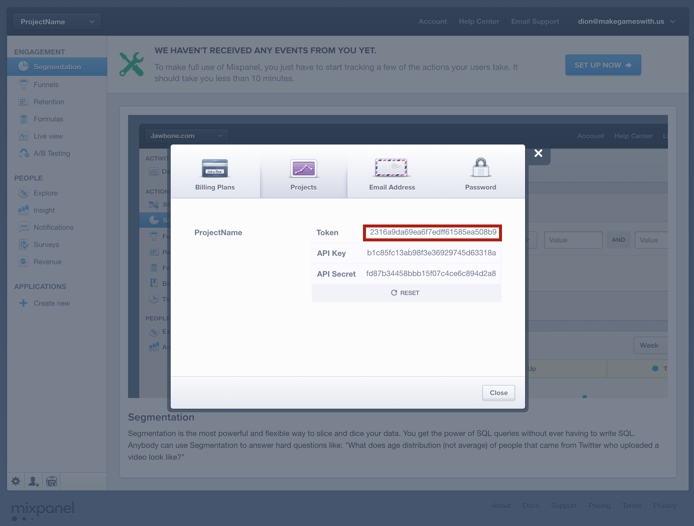

> [info]
>This guide will serve as a review if you already went through the CocoaPods portion of Makestagram. We will specifically discuss installing Mixpanel for analytics. If you already have CocoaPods set up with your project, you can skip to *Installing Mixpanel*.

There are a lot of software developers worldwide and through the internet we are better connected than ever. Platforms such as GitHub and StackOverflow further improve our ability to share solutions to common problems we face in software development.

Once you start developing software, you will realize that many, if not most, of the problems you encounter have been solved by someone else before. Reusing these solutions in our own projects allows us to build software at an unprecedented speed.

This will review how to easily incorporate third-party code into your iOS projects.

#What Is a Dependency Manager?

One way of adding third-party code to your project would be to download all of the source code and copy it into your project.

This may sound straightforward, but in reality this approach will fail for many projects. Many third-party libraries come with their own dependencies and very special rules about how they need to be compiled; information that is not in the source files but in the project file of the library.

Even if that approach works, you will have a hard time updating the library. You will have to remove all code and add it again.

To avoid such kinds of problems, other software developers have built dependency managers. The most popular one for iOS is _CocoaPods_.

#How Does CocoaPods Work?

_CocoaPods_ provides a huge repository of available iOS libraries. When you want to use _CocoaPods_ you add a special file to your project in which you can list your dependencies. That file is called a _Podfile_.

If you want to use a library, you need to enter the name (and optionally the version) of the library into your _Podfile_. Then you can use one of _CocoaPods_'s commands to install the library that you listed in the _Podfile_.

#Installing CocoaPods

As a first step, we need to install the _CocoaPods_ software.

> [action]
> Open a terminal and enter the following line:
>
>        sudo gem install cocoapods

After a while the installation should complete successfuly!

#Setting up A Podfile

Now we can create a _Podfile_ that will allow us to declare dependencies for our project. The _CocoaPods_ tool provides us with a convenient method to do this:

> [action]
> Open the root directory of your project in a terminal and type:
>
>        pod init

Now a _Podfile_ with some skeleton content will be created. Open the _Podfile_ in your favorite text editor. It should look like this:

    # Uncomment this line to define a global platform for your project
    # platform :ios, '6.0'

    target 'ProjectName' do

    end

    target 'ProjectNameTests' do

    end

#Installing Mixpanel

Now we are ready to add a dependency to this file. For the feature we want to implement - displaying the amount of time that has passed since a post was created - we want to use the _DateTools_ library.
It will help us to convert time spans into human readable strings.

> [action]
> Add the _Mixpanel_ dependency to your _Podfile_ and add `use_frameworks!` at the top so that it looks like this:
>
>        # Uncomment this line to define a global platform for your project
>        # platform :ios, '6.0'
>
>       use_frameworks!
>    
>        target 'ProjectName' do
>          pod 'Mixpanel'
>        end
>    
>        target 'ProjectNameTests' do
>    
>        end
>
> Then, return to the command line and run:
>
>        pod install

Now your dependencies will be download and installed.

**The next step is very important.** After you have installed your first library, _CocoaPods_ will generate an _Xcode workspace_ for you. When using _CocoaPods_, you need work with that _workspace_ and no longer with the Xcode _project_ that you have been working with.

> [action]
> **Close** your Xcode project. Then open the new **workspace** that _CocoaPods_ has generated:
> 

<!-- NOT REQUIRED because of use_frameworks! config

#Importing Mixpanel-->

<!--Mixpanel is written in Objetive-C, Apple's old default programming language for iOS. It needs to be imported through the the _Bridging Header_.-->

<!--> [action]-->
<!--> Add the _Mixpanel_ library to your project's' bridging header by adding the following line:-->
<!-->-->
<!-->        #import "Mixpanel.h"-->

#Signing up for Mixpanel

> [action]
> Go to [Mixpanel](https://mixpanel.com/register/) and register for an account. Once logged in, create a new project from the top-left corner. The name should match your project name.

You should see something like this:

#Setting up Mixpanel

> [action]
> Now we can finally use Mixpanel. Open _AppDelegate.swift_ and add this import to the top:
>
>       import Mixpanel
>
> Now add the following to the `application` method so that it gets run after the app is launched.
>
>        Mixpanel.sharedInstanceWithToken(YOUR_TOKEN_HERE)
>        let mixpanel: Mixpanel = Mixpanel.sharedInstance()
>        mixpanel.track("App launched")

You can find your token by clicking on *Account* then *Projects* on the [Mixpanel website](https://mixpanel.com/). Copy and paste your token where `YOUR_TOKEN_HERE` is in the code you just added.

#Test it out

Run your app. If everything was set up correctly, you should now see an app launched event in the [Mixpanel dashboard](https://mixpanel.com)!

> [action]
> Mixpanel batches events together to send them. You may need to close the app for the event to be sent. Press the home button if testing on a device or `CMD + Shift + H` if using the simulator.
