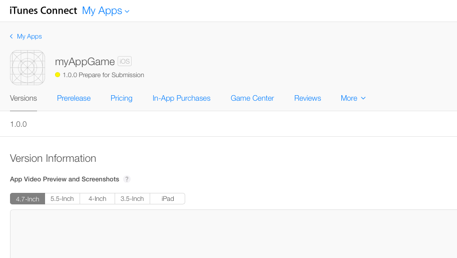
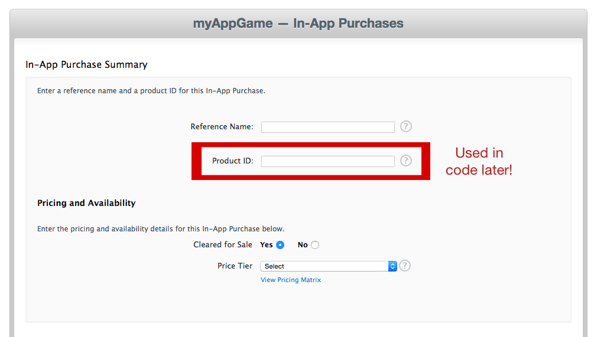
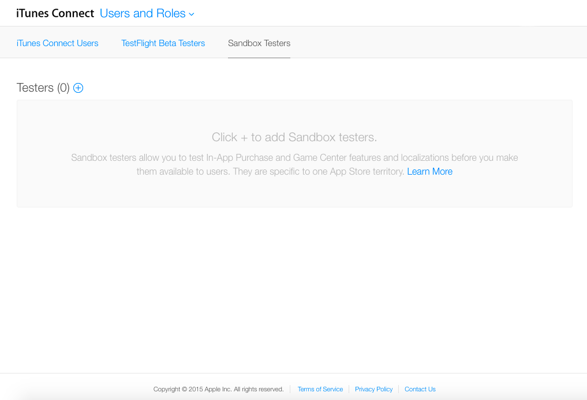
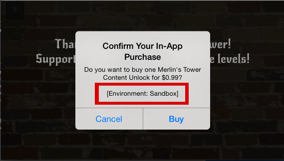

As your product nears readiness for the App Store, the thought may have crossed your mind to try to make some money off your app or game.  There are two mechanisms to do this: up front purchase cost and in app purchases.  Up front purchase will ensure that you make some money with each download, but vasty decreases download count.  Its much more common (and profitable) to make the download free, but offer things to buy once the user is engaged with the product.  This tutorial will walk through the steps required to add an in app purchase, or IAP, to your app or game.  We will start with a couple assumptions: you already have an Apple developer account and the app is already added to your developer account in iTunes Connect.  The first step is documenting the purchase in iTunes Connect.

#Getting Started

Sign on to iTunes Connect and navigate to "My Apps".  Select the app that you want to add the IAP to.  You should see something similar to this:

Navigate to the In-App Purchase tab and create a new IAP.  Now its time to choose what kind of IAP your product will offer.  Apple provides five different IAP options, grouped into subscription and consumable types.  You will probably choose the one of the consumable types, and it is important to know the difference.  

Consumable purchases provide a benefit once, say some extra coins to spend.  Non-Consumable purchase provide a permanent benefit, like unlocking a new character.  Consumable purchases cannot be restored.  Non-consumable purchases can be restored, and Apple requires an app to allow customers to restore these purchases.  Regardless of the option you choose, the information required is similar across all types. 

Once you select the type of purchase, you will need to complete the form describing the product you want to offer.  You will need to provide some unique identifiers for the product, the price, a customer facing name for the product and a relevant screenshot.  The important field that will be used later is the _Product ID_ field.  This is the string we will use in code to look up the product and offer it to the customer.  Save the form and keep that Product ID handy.

#Write the Code

With the IAP listed in iTunes Connect it's time to implement the purchase of the product.  The code is tricky and can be difficult to follow, but we'll provide some functioning code to build off of.  Don't worry if it doesn't make sense right away.  Click through the links to learn about advanced concepts you aren't familiar with.  We'll be using Apple's [StoreKit](https://developer.apple.com/library/mac/documentation/StoreKit/Reference/StoreKit_Collection/) framework to fetch information, request and then execute purchases.

The first step is to look up product information.  The product was registered with Apple in iTunes Connect, we need to retrieve it.  The *SKProductsRequest* class will act as our black box to start talking to Apple.  It's also a good to check if purchases are currently possible.  That is done with a *SKPaymentQueue* class function.  Here's an implemented example of the step:

		//called by you, to start purchase process
		func attemptPurchase(productName: String) {
            if (SKPaymentQueue.canMakePayments()) {
                var productID:NSSet = NSSet(object: productName)
                var productRequest:SKProductsRequest = SKProductsRequest(productIdentifiers: productID as Set<NSObject>)
                productRequest.delegate = self
                productRequest.start()
            } else {
                //notify user?
            }
        }
        
Reviewing the code reveals that we need to set a [delegate](https://developer.apple.com/library/mac/documentation/General/Conceptual/DevPedia-CocoaCore/Delegation.html) as part of the process.  The [protocol](https://developer.apple.com/library/mac/documentation/General/Conceptual/DevPedia-CocoaCore/Protocol.html#//apple_ref/doc/uid/TP40008195-CH45-SW1) for this delegate is *SKProductsRequestDelegate*.  This delegate will call back once the _productRequest_ object finished its task.  The function it calls back it is productsRequest(_: SKProductsRequest!, didReceiveResponse _: SKProductsResponse!), so implementing it is required to conform to the protocol.  

The function gives back the original request and a *SKProductsResponse* object, which contains the results of searching for the string you initially provided.  If the string matches the productID entered in iTunes Connect, the *SKProductsResponse* object will contain (among other things) an array which contains a *SKProduct* object.  We can use this object to continue the purchase process.  

		// SKProductsRequestDelegate method
      	func productsRequest(request: SKProductsRequest!, didReceiveResponse response: SKProductsResponse!) {
      		var count: Int = response.products.count
      		if (count > 0) {
	           var validProducts = response.products
	           var product = validProducts[0] as! SKProduct
			   buyProduct(product)
      		} else {
   				//something went wrong with lookup, try again?
			}
		}

Now that you have a valid *SKProduct* object, you can now offer the product to the user to buy.    Construct an *SKPayment* object out the product.  The payment object is processed through the *SKPaymentQueue* class.  The class provides a [singleton](https://developer.apple.com/library/ios/documentation/General/Conceptual/DevPedia-CocoaCore/Singleton.html), _defaultQueue()_, to set up the [observer](https://en.wikipedia.org/wiki/Observer_pattern) and start the payment process.  The _buyProduct()_ function encapsulates this and can look something like this:

        //called after delegate method productRequest
        func buyProduct(product: SKProduct) {
            var payment = SKPayment(product: product)
            SKPaymentQueue.defaultQueue().addTransactionObserver(self)
            SKPaymentQueue.defaultQueue().addPayment(payment)
        }

Now the final step is listening for the observer callbacks from the *SKPaymentQueue* through the protocol *SKPaymentTransactionObserver*.  In order to conform to the protocol, the function paymentQueue(queue: SKPaymentQueue!, updatedTransactions transactions: [AnyObject]!) has to be implemented. 

This function will be called multiple times as the transaction is processed.  *SKPaymentTransaction* objects contained in the _transactions_ argument have a _transactionState_ property that should be examined.  This will inform the state of any transaction in progress.  When the property reaches a .Purchased or .Failed state, the transaction should be finished and appropriate actions should be taken.  

The transaction is finished by providing the transaction as an argument to a _queue.finishTransaction(:)_ function call.  You should also take action to notify the user and make the product available after a successful purchase.  This is the most complicated and important bit of code yet.  Here's an example:

        //SKPaymentTransactionObserver method
        func paymentQueue(queue: SKPaymentQueue!, updatedTransactions transactions: [AnyObject]!) {
            println("recieved response")
            for transaction: AnyObject in transactions {
                if let tx: SKPaymentTransaction = transaction as? SKPaymentTransaction {
                    switch tx.transactionState {
                    case .Purchased, .Restored:
                        println("product purchased/restored")
                        queue.finishTransaction(tx)
                    case .Failed:
                        println("oops, purchase failed!")
                        queue.finishTransaction(tx)
                    case .Purchasing, Deferred:
                        println("waiting for completion...")
                    }
                }
            }
        }
        
Reviewing the code reveals another value for the *transactionState* to be in.  The extra state to be aware of is _.Restored_.  Any IAP that is non-consumable has to have a mechanism to restore it.  **Apple will not approve an app that does not have this**.  Fortunately, there is a straightforward way to initiate the restoration.  Using the same *SKPaymentQueue* singleton from before, call the function _restoreCompletedTransactions()_ to begin the restoration process.  Don't forget to add an observer before starting the restoration.   

        //called by you, to start restore purchase process
        func attemptRestorePurchase() {
            if (SKPaymentQueue.canMakePayments()) {
                SKPaymentQueue.defaultQueue().addTransactionObserver(self)
                SKPaymentQueue.defaultQueue().restoreCompletedTransactions()
            }
        }
        
There are many pieces here, putting them together successfully can provide a new way to monetize your app.  If copying and pasting all the code snippets is too much for you, download an assembled source file [here](https://github.com/MakeSchool-Tutorials/SA-2015-Games-Additional-Resources/raw/master/P8-In-App-Purchase/IAPHelper.swift).  Before the app is released, however, it's important to test the IAP.  This is not as straight forward as it seems.

#Testing 

In order to test implemeneted IAPs, you need to create a Sandbox Tester account to perform test purchases.  This is a simple process done in iTunes Connect.  Sign back in to iTunes Connect and navigate to "Users and Roles".  Select the "Sandbox Testers" tab, which will land you at something like this:

Follow the directions to start creating a new tester.  You will need to provide some basic information to create the account.  Once the account is created, you will need to sign on to the device you are testing with the sandbox account you created.  You can then go ahead and attempt the purchase with the sandbox account.  The purchase dialog will let you know you are in the sandbox:

You will get the appropriate responses back from Apple so you can verify the purchases work without being charged.  Now that you have created the IAP, implemented the transaction and tested the process it's time to finish up the app and ship it to the App Store.

#Summary

Apple provides the StoreKit framework to let customers buy products while inside a running app.  It is a multi-step process to perform the IAP: register the purchase in iTunes Connect, use the *SKProductsRequest* class to lookup the product, then initiate the transaction with the *SKPaymentQueue*.  To test the IAP while in development, a sandbox tester account is required.  This kind of account can be created in iTunes Connect.  If you choose to have non-consumable purchases, you **must** provide a way for customers to restore purchases.  **Apple will not approve an app that does not provide this**.  Now you have the tools needed to further monetize your app.  Happy coding!

